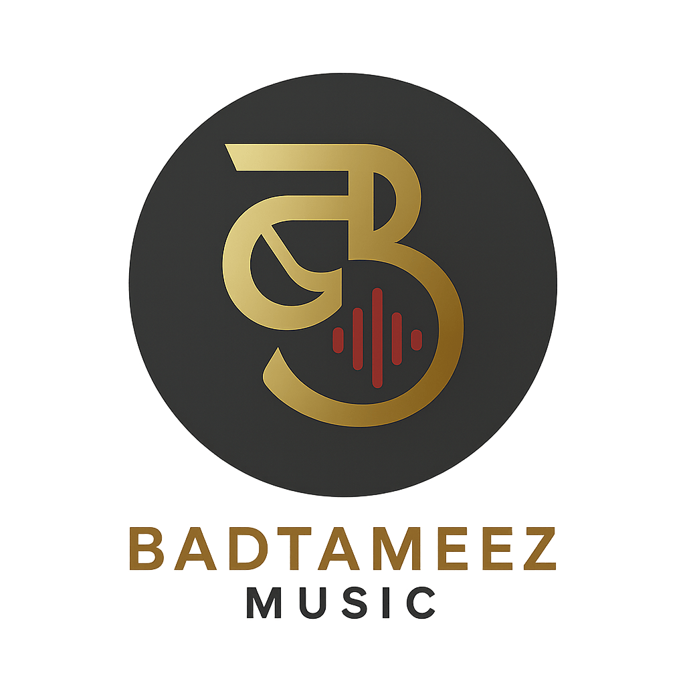

<div align="center">
  
  <h1>BADTAMEEZ · MAHAVEER JAIN</h1>
  <p><strong>Software Developer (7+ Yrs) · Lyricist · Songwriter · Poet · Visual Artist</strong></p>
  <p><em>“naram dil, garam alfaaz, bas yahi hai apna andaaz!”</em></p>

  <p>
    
    
    
    
    
  </p>
</div>

---

## 🌟 Overview

**Badtameez Music** is the official full-stack creative portfolio and content management workspace of **Mahaveer Jain** — a Senior Software Developer with 7+ years of enterprise experience (C#, ASP.NET, React, Blazor, SQL, DB2) who writes, composes, and produces original music, Hindi/Urdu poetry, and visual arts.

This application is built with modern web principles: zero bloat, pure vanilla frontend architecture, rich antique gold & dark charcoal glassmorphism, 60FPS audio visualizers, and a secure backend CMS powered by **Express.js** and **MongoDB Atlas**.

---

## 🛠️ Architecture & Features

### 1. 🎵 Discography & Embedded Music Player
- **Zero-Redirect Playback**: Direct inline streaming of YouTube & Spotify releases via custom player modals.
- **Atmospheric Studio Visualizer**: HTML5 Canvas frequency waveform simulation with real-time toggleable ambient rain/reverb soundscapes.
- **Lyrics Modal**: Synchronized lyrics view in dual script format.

### 2. ✍️ Dual-Language Poetry Notebook (Kalam & Kagaz)
- **Instant Script Switcher**: Seamless live toggle between **Hindi Devanagari** and **Romanized Hinglish**.
- **Dynamic Filter Tabs**: Filter poems by custom categories (*Emotional*, *Motivational*, *Love/Romantic*, *Other*).
- **Interactive Actions**: One-click "Copy Verse to Clipboard" with author credits and modal expanders.

### 3. 💻 Tech & Engineering Profile
- **Enterprise Showcase**: Interactive architectural cards documenting large-scale government enterprise platforms (*RSMML* & *RIICO*).
- **Skill Pill Taxonomy**: Categorized badges for Frameworks, Databases (IBM DB2, SQL Server), IDEs, and AI tools (Claude, Antigravity 2.0, Codex).

### 4. 🛡️ Executive Admin Dashboard (`/admin`)
- **Full-Spectrum Dynamic CMS**: Manage and update every section with zero code changes:
  - **Songs**: Add tracks, YouTube/Spotify IDs, custom artwork uploads, and lyrics.
  - **Poetry & Recitals**: Add/edit/delete couplets, custom categories, and YouTube video recitals.
  - **Enterprise Projects**: Manage client architecture cards and tech stacks.
  - **Gallery & Bio**: Manage cover artwork and narrative pillars.
  - **Inquiries Inbox**: View visitor inquiries, mark as read, and delete.
- **JWT & Rate-Limited Auth**: Protected by bcrypt hashing and brute-force lockouts.

### 5. 🔒 Security & Performance Hardening
- **Cloud Database (MongoDB Atlas)**: Document persistence in cloud database with TLS encryption.
- **HTTP Security Headers (`helmet`)**: Strict Content Security Policy allowing YouTube/Spotify embeds.
- **Anti-Spam & Honeypot**: IP rate-limiting (`express-rate-limit`) on contact submissions plus invisible honeypot trap.
- **Automated Email Alerts (`nodemailer`)**: Instant email notifications dispatched directly to `shayrana.in@gmail.com` on contact form submission.
- **SEO & Google Search**: `robots.txt`, `sitemap.xml`, and Google **JSON-LD Schema Markup** (`Person` & `MusicArtist`).
- **Gzip/Brotli Compression (`compression`)**: High-speed asset delivery.

---

## 📂 Project Structure

```text
BadtameezMusic/
├── assets/
│   ├── audio/                # Ambient soundscapes & audio tracks
│   └── images/               # Release artworks, badges, and logo
├── css/
│   ├── admin.css             # Glassmorphic admin control center styling
│   ├── responsive.css        # Mobile drawers, breakpoints & touch layout
│   └── style.css             # Main aesthetic design system (Dark & Gold)
├── js/
│   ├── admin.js              # Admin Dashboard controller & CRUD engine
│   ├── ambient-sound.js      # Studio ambient generator & visualizer
│   ├── audio-player.js       # Track manager & embedded YouTube/Spotify engine
│   ├── main.js               # UI animations, contact submission & hydration
│   ├── notebook.js           # Poetry dual-language & dynamic tabs engine
│   └── tech-terminal.js      # Interactive developer terminal simulation
├── server/
│   ├── data/
│   │   └── database.json     # Local fallback database
│   ├── models/
│   │   └── Schemas.js        # Mongoose Schema definitions
│   ├── db.js                 # Dual-mode Cloud MongoDB & Local DB Manager
│   ├── email.js              # Nodemailer email alert dispatcher
│   └── server.js             # Express.js REST API & production server
├── .env.example              # Environment variables template
├── .gitignore                # Security git ignore rules
├── admin.html                # Admin CMS Portal
├── index.html                # Main Public Showcase
├── package.json              # Node.js dependencies & scripts
├── robots.txt                # Search engine crawler policies
└── sitemap.xml               # Search engine XML sitemap
```

---

## ⚡ Quickstart & Setup

### 1. Clone & Install Dependencies
```bash
git clone https://github.com/badtameez/BadtameezMusic-.git
cd BadtameezMusic-
npm install
```

### 2. Configure Environment Variables
Copy the `.env.example` file to `.env`:
```bash
cp .env.example .env
```

Edit `.env` with your credentials:
```env
PORT=5000
JWT_SECRET=your_super_secret_jwt_key
MONGODB_URI=mongodb+srv://<user>:<password>@cluster0.abcde.mongodb.net/badtameez_db?retryWrites=true&w=majority
ADMIN_EMAIL=your_email@gmail.com
SMTP_HOST=smtp.gmail.com
SMTP_PORT=587
SMTP_USER=your_email@gmail.com
SMTP_PASS=your_16_letter_app_password
```

### 3. Run Locally
```bash
npm start
```

- 🌐 **Public Website**: [http://localhost:5000](http://localhost:5000)
- 🛡️ **Admin Portal**: [http://localhost:5000/admin](http://localhost:5000/admin)
- 🩺 **Health Check**: [http://localhost:5000/api/health](http://localhost:5000/api/health)

---

## 🌐 Public REST API Endpoints

| Method | Endpoint | Description |
| :--- | :--- | :--- |
| `GET` | `/api/content` | Fetch all public website content (Hero, Tech, Songs, Poetry, Gallery, About) |
| `POST` | `/api/contact` | Submit a contact / collaboration inquiry (Rate limited & Honeypot protected) |
| `GET` | `/api/health` | Service liveness probe & database connection status |
| `POST` | `/api/auth/login` | Admin JWT login authentication |
| `POST` | `/api/admin/*` | Authenticated CMS CRUD endpoints (Songs, Poetry, Projects, Gallery, Settings) |

---

## 📜 License
Original lyrics, compositions, and artworks © **Mahaveer Jain (Badtameez Music)**. All rights reserved.
Software code licensed under the ISC License.
